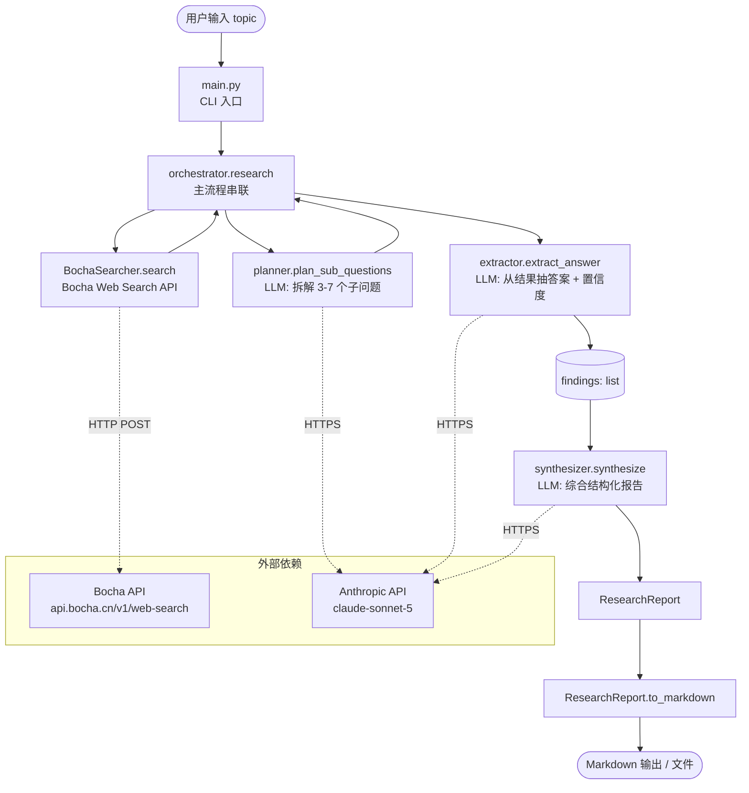

# 深度研究助手 (Deep Research Assistant)

按 [README.md](./README.md) 的需求实现:输入研究主题 → 自动检索 / 阅读 / 综合 → 输出带来源引用的结构化报告。

## 架构



## 数据流

```
topic (str)
  └─ plan_sub_questions  ─→ [SubQuestion]
       └─ for each: searcher.search  ─→ [SearchResult]
            └─ extract_answer  ─→ Finding (answer + confidence + sources)
  └─ synthesize(findings) ─→ ResearchReport (summary / sections / sources / log / open_q)
       └─ to_markdown()   ─→ 字符串
```

## 文件结构

```
demo/
├── main.py                 # CLI: python main.py "研究主题" -o report.md
├── demo.py                 # 离线自检 (无 API 调用,直接 python demo.py)
├── requirements.txt        # 仅 anthropic 一个第三方依赖
├── .env.example            # BOCHA_API_KEY / ANTHROPIC_API_KEY
├── CLAUDE.md               # 本文件
└── research/
    ├── __init__.py
    ├── models.py           # SearchResult / SubQuestion / Finding / ResearchReport (+ to_markdown)
    ├── search.py           # BochaSearcher — stdlib urllib,无 httpx
    ├── llm.py              # Anthropic 封装:complete / complete_json
    ├── planner.py          # topic → 子问题
    ├── extractor.py        # 子问题 + 检索结果 → Finding
    ├── synthesizer.py      # findings → ResearchReport
    └── orchestrator.py     # research(topic): 串起 plan→search→extract→synth
```

## 运行

```bash
pip install -r requirements.txt
cp .env.example .env  # 填入 BOCHA_API_KEY 与 ANTHROPIC_API_KEY
python main.py "2026 年具身智能机器人行业趋势" -o report.md
```

## 设计要点

- **单一职责**: 每个模块只做一件事。`search.py` 不调 LLM,`llm.py` 不发搜索请求,`orchestrator.py` 是唯一的串联点。
- **可替换性**: `research(topic, searcher, llm)` 接受依赖注入。后续要做单元测试或换搜索引擎(Bing / Tavily),只换 `BochaSearcher` 的实现即可,流程不动。
- **可追溯性**: `SearchResult` 是不可变 dataclass,流过 planner → extractor → synthesizer → report 全程不丢 URL。`ResearchReport.sources` 在 synthesizer 里 dedup 但保留首次出现的顺序。
- **置信度透传**: extractor 让 LLM 给每条 finding 打 confidence(0-1),synthesizer 在 prompt 里把 confidence 一起喂进去,让模型在写报告时知道哪些结论更可靠。

## 简化说明 (ponytail)

下面这些是显式跳过的,每个都标了"什么时候加回来":

- **单轮检索 / 无 judge 循环**: 当前每个子问题只搜一轮。ponytail: 跳过 judge/refine 迭代循环,当出现"来源明显不足 / 答案含糊"再加 `judge_enough()` + max_iters 循环。
- **不做全页抓取**: 复用 Bocha `summary=true` 返回的摘要作为抽取输入。ponytail: 跳过 readability/fetch 全页,当摘要信息密度不够或需要长文论证时再加 `fetcher.py`。
- **JSON-from-LLM 用字符串包裹**: 不引 pydantic / instructor。ponytail: 当字段变多 / 解析失败频次变高再加。
- **无持久化**: 报告一次性写到文件,无 SQLite / 向量库。ponytail: 当需要跨会话复用研究上下文、增量研究或缓存去重时再加。
- **进程内 process_log**: 用 list[str] 攒步骤日志,没有结构化 trace。ponytail: 当需要 trace UI / 调试 / 重放时再加 LangSmith / 自建 trace。
- **无并发**: planner → 多组 (search+extract) 是顺序的。ponytail: 子问题之间彼此独立,加 `concurrent.futures.ThreadPoolExecutor` 即可并行,延迟可砍一半。